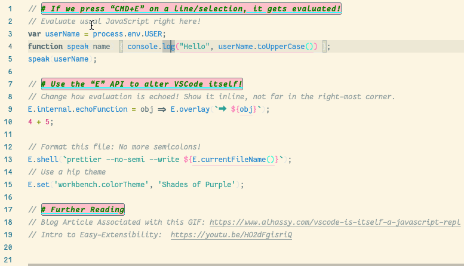
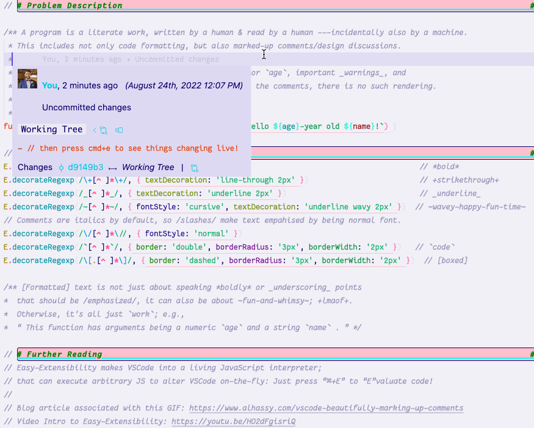
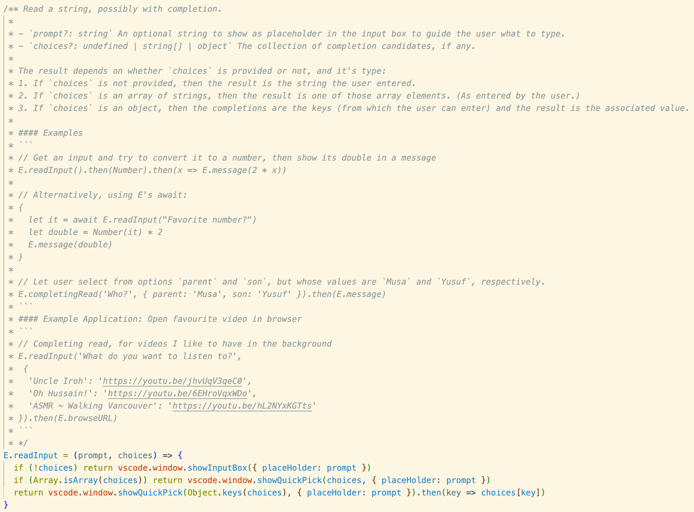
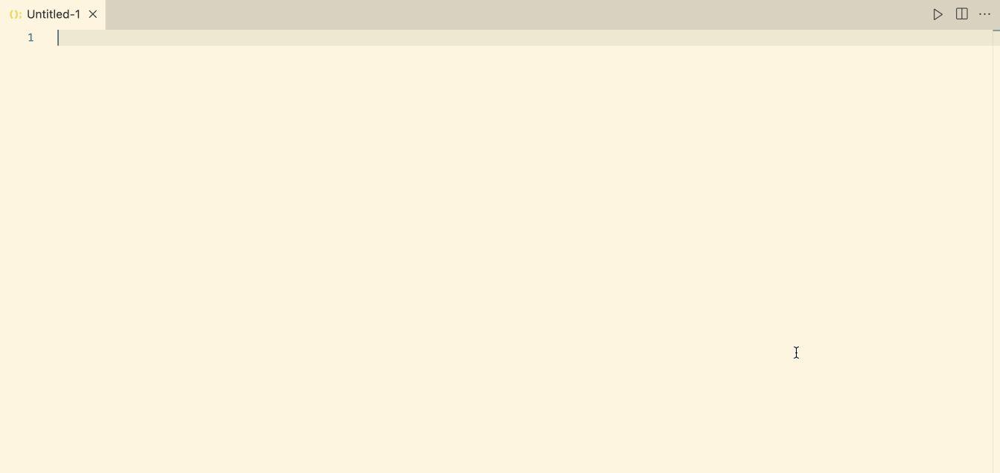
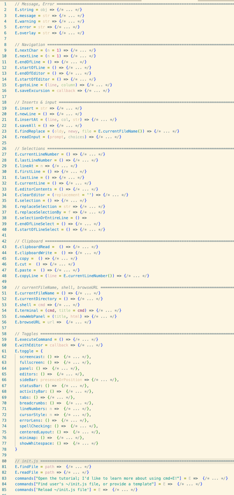

<!-- logo=Gnu-Emacs  ~~~ a nice big `E` ;-) !-->

#  `easy-extensibility`

Extend VSCode without the ceremony of making a full extension! Just write your code anywhere and it'll be part of VSCode!

- [Introductory Youtube Video](https://youtu.be/HO2dFgisriQ)
- [See many more GIFS/articles here!](https://www.alhassy.com/tag/vscode-tips)

[💐 VSCode is itself a JavaScript REPL 🔁:](https://www.alhassy.com/vscode-is-itself-a-javascript-repl)

<!--

  -->

## Features

- New keybinding: `cmd+E` to evaluate a selection of JavaScript, or the entirety of the current line.
  <!-- + Results are echoed in a notification, in the lower-right. Redefine `E.internal.echoFunction` to change the style. -->
  +  Use `shift+cmd+E` to insert the result onto the next line.
- New keybinding: `cmd+H` to provide a command pallet for user-defined commands using this extension.
  <!-- + Use `shift+cmd+H` to pass a so-called *prefix argument*. -->
- The *easy-extensibility Extension API*, or “E API”, which acts as a high-level user-friendly alterative to the default *vscode Extension API*.

#### Accessibility
- 🚴 Open the tutorial to learn more about using `cmd+E` by invoking `cmd+h tutorial`
- 📚 To learn about “saving reusable functions and having them load automatically”, please invoke `cmd+h find users init.js file, or provide a template`

#### Extensive Docs
The `E API` is well-documented; for example the `E.readInput` method's docs even suggest an example user extension. 🚀

#### Anaphoric Usage (with code completion & docstrings)

The current implementation treats VSCode  as if it were dynamically-scoped: Any open editor may mention `E, commands, vscode` with *no ceremonial import* of any kind!
- This is similar to the use of the keyword `this` in object-oriented programming: It's an implicitly introduced argument!

However, for discovarability and example uses, it would be nice
to have code completetion: Just write `E.` and wait a second to
see possible completions ---or write the name of the method you
want to use and if it's part of the `E` API, you'll also get completion as shown below.

#### A growing user-friendly API!

## Why this (meta)extension?

<!-- Describe specific features of your extension including screenshots of your extension in action. Image paths are relative to this README file.

For example if there is an image subfolder under your extension project workspace:

\!\[feature X\]\(images/feature-x.png\)

> Tip: Many popular extensions utilize animations. This is an excellent way to show off your extension! We recommend short, focused animations that are easy to follow. -->

There is essentially only one step (⭐) to making an extension.
🤗 Sharing an extension, such as a tiny 5-line command, should be as easy as having that defintion code readily available.

In constrast, the default approach to making a VSCode extension is as follows:
1. 😱 Make a new NodeJS project, say with `yo code` as per https://code.visualstudio.com/api/get-started/your-first-extension
2. ⭐ Actually write your extension's code
3. 😱 Run your code in a dedicated sandbox with `F5`, far from your code
4. 😱 Try your extension; stop the sandbox; alter your code; repeat.
5. Now to actually make use of your extension, you should pacakge it with `vsce package`
   - To share it with others, you'll need to:
      1. 😱 Make a Microsoft account
      2. 😱 Make a new Azure organisation, as in https://dev.azure.com/alhassy
      3. 😱 Create a Personal Access Token for use in the extension marketplace; as per https://code.visualstudio.com/api/working-with-extensions/publishing-extension

This approach doesn't encourage making extensions ---since there's so much ceremony--- and it, likewise, doesn't encourage sharing/packaging up the resulting (tiny) extensions.

🔥 Invoke  `cmd+h tutorial` to see the tutorial, which
concludes with a comparison of our
 `init.js`-style extensions
 versuses thats of the default VSCode style.

<!-- ## Development

0. `cd ~; git clone https://github.com/alhassy/easy-extensibility`
0. `cd ~/easy-extensibility; npm ci`
1. `code ~/easy-extensibility`
2. `F5`
3. Open a new `~/scratch.js` file
4. Enter some JavaScript, such as `2 + 4`, then press `cmd+e` to see its resulting evaluation.
5. Now enter more interesting code that *alters the look and feel of VSCode*, such as
   `E.toggle.linenumbers()` and press `cmd+e` to execute it and see things change! -->
<!-- 3. In the new VSCode instance, `Cmd+Shift+P` then `Hello World` to see things run.
 -->

<!-- ## TODO Requirements

If you have any requirements or dependencies, add a section describing those and how to install and configure them.
 -->

<!-- ## TODO Extension Settings

Include if your extension adds any VS Code settings through the `contributes.configuration` extension point.

For example:

This extension contributes the following settings:

* `myExtension.enable`: enable/disable this extension
* `myExtension.thing`: set to `blah` to do something

## TODO Known Issues

Calling out known issues can help limit users opening duplicate issues against your extension.
 -->
<!-- ## TODO Release Notes

<!-- Users appreciate release notes as you update your extension.

All notable changes to the "easy-extensibility" extension will be documented in this file.

Check [Keep a Changelog](http://keepachangelog.com/) for recommendations on how to structure this file.

### 0.0.1 Hello, World!

Initial release; provides the `Hello World` command from the `cmd+shift+P` pallet.

### 1.1.1 Next, finish drawing the rest of the owl!

- New keybinding: `cmd+E` to evaluate a selection of JavaScript, or the entirety of the current line.
- New keybinding: `cmd+H` to provide a command pallet for user-defined commands using this extension.
- The *easy-extensibility Extension API*, or “E API”, which acts as a high-level user-friendly alterative to the default *vscode Extension API*.

Also,
- To learn about “saving reusable functions and having them load automatically”, please invoke `cmd+h find users init.js file, or provide a template`
- Open the tutorial to learn more about using `cmd+E` by invoking `cmd+h tutorial`

### 1.1.2 Minor typo fixes
 -->